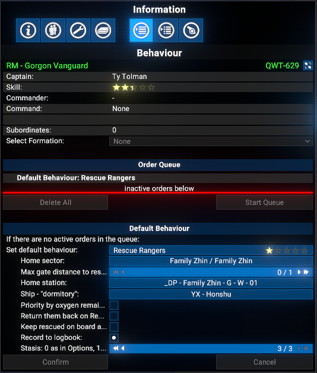
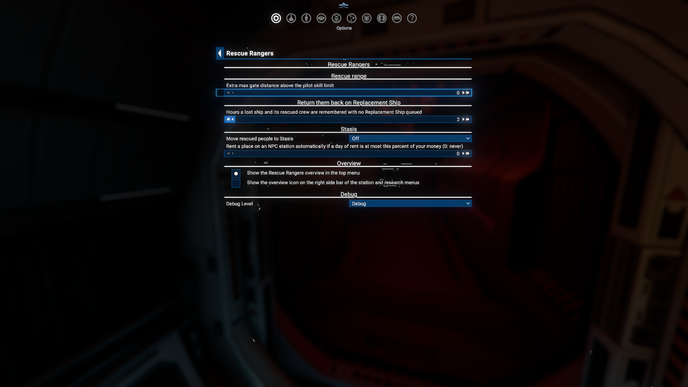
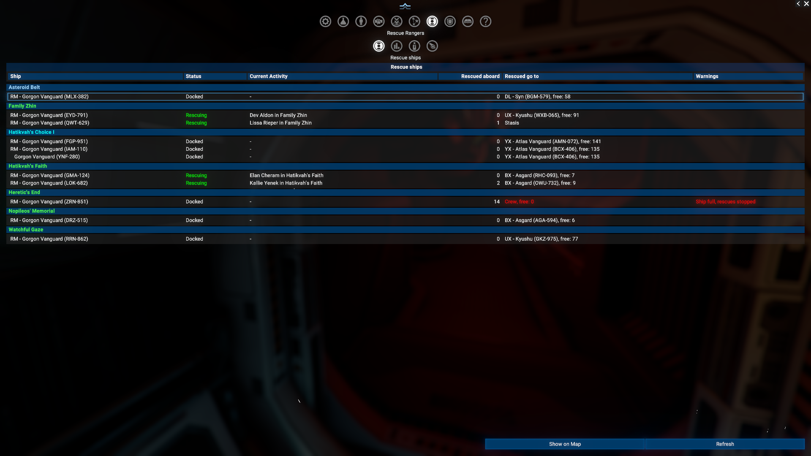
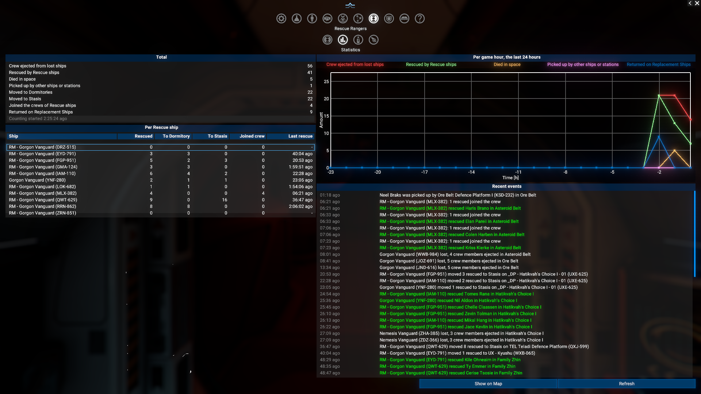
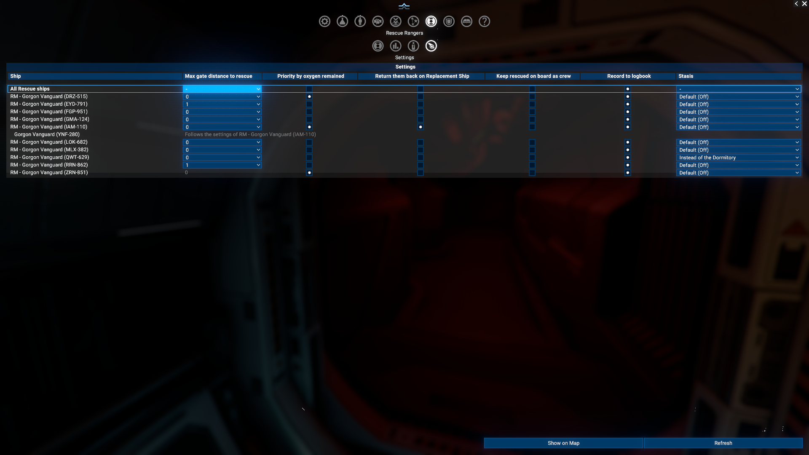
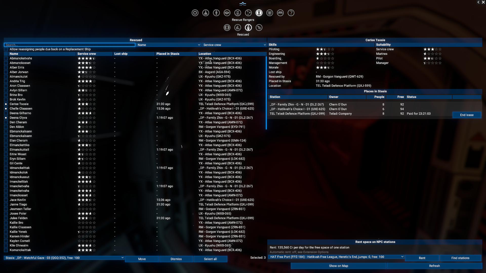
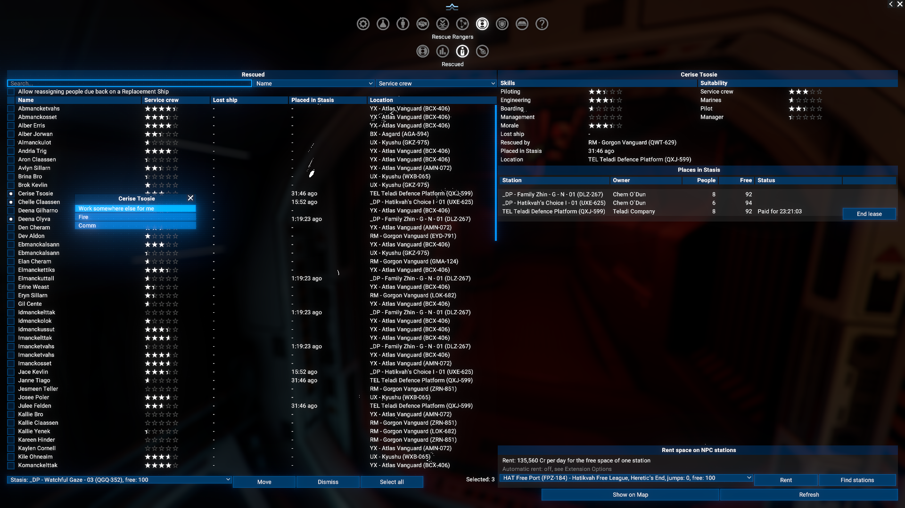
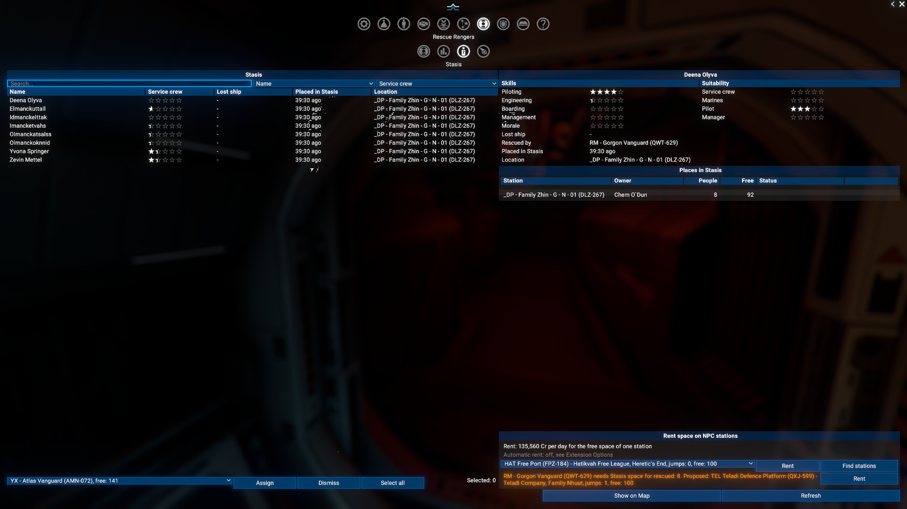

# Rescue Rangers

Your ships rescue the crews of your destroyed ships from space and bring them to a station, a "Dormitory" ship, or Stasis.

## Features

- **Sector mode** - the Rescue ship waits at its Home Station and covers the Home Sector and the sectors within its gate range.
- **Fleet support mode** - with no Home Station set, the Rescue ship docks at its "Dormitory" ship and covers the sector it is in.
- **Mimic** - fully supported in fleets.
- **Rescue priority** - the nearest spacesuit first, or the one with the least oxygen left.
- **Several Rescue ships** - can share one sector or overlapping ranges without chasing the same person.
- **Return them back on Replacement Ship** - rescued crew is returned on the Replacement Ship of the ship they were lost from.
- **Keep rescued on board as crew** - rescued people join the Rescue ship's crew right away.
- **Stasis** - rescued people are kept on your stations or on space rented on NPC stations, instead of filling a "Dormitory" ship.
- **Overview** - the `Rescue Rangers` overview in the top menu shows every Rescue ship, the rescue statistics, everyone rescued and each Rescue ship's settings.

## Requirements

- **X4: Foundations**: Version 8.00 or 9.00.
- **Mod Support APIs**: Version 1.95 or higher by [SirNukes](https://next.nexusmods.com/profile/sirnukes?gameId=2659).
  - Available on Steam: [SirNukes Mod Support APIs](https://steamcommunity.com/sharedfiles/filedetails/?id=2042901274)
  - Available on Nexus Mods: [Mod Support APIs](https://www.nexusmods.com/x4foundations/mods/503)
- **Options Helper**: Version 1.10 or higher by [SirNukes](https://next.nexusmods.com/profile/sirnukes?gameId=2659).
  - Available on Steam: [Options Helper](https://steamcommunity.com/sharedfiles/filedetails/?id=3715253556)
  - Available on Nexus Mods: [Options Helper](https://www.nexusmods.com/x4foundations/mods/2089)
- **Print Extension List**: Version 1.00 or higher by [Chem O`Dun](https://next.nexusmods.com/profile/ChemODun/mods?gameId=2659).
  - Available on Steam: [Print Extension List](https://steamcommunity.com/sharedfiles/filedetails/?id=3770927339)
  - Available on Nexus Mods: [Print Extension List](https://www.nexusmods.com/x4foundations/mods/2191)

## Installation

- **Steam Workshop**: [Rescue Rangers](https://steamcommunity.com/sharedfiles/filedetails/?id=3385833966)
- **Nexus Mods**: [Rescue Rangers](https://www.nexusmods.com/x4foundations/mods/1571)

## Save state

**No** (removing the extension does not break saves).

## How it works

The Rescue ship waits docked at its Home Station, or at its "Dormitory" ship in the `Fleet support` mode. When one of your ships is destroyed in the area it covers, it flies out and picks up the spacesuits of the crew. When the sector of the loss has no spacesuits left, it checks the other sectors in range, nearest first.
If it gets full before everybody is picked up, it transfers the rescued crew to the "Dormitory" ship and goes on with the rescue.
When everybody is picked up, it flies back and docks. At the Home Station it waits for a quiet period before it transfers the rescued crew to the "Dormitory" ship; in the `Fleet support` mode it transfers them right after docking.
With `Keep rescued on board as crew` the rescued people stay aboard as crew, and with Stasis they go to a place in Stasis, see below.
Check the "Dormitory" ship from time to time and move the rescued crew to new ships, or let `Return them back on Replacement Ship` do it.

## Executing the order

You can select the order as any other, "default", from the "Navigation" section of orders.
Please be aware - this order requires the ship captain to have at least `one star` in the "Pilot" skill.

## Configuration

There are several configuration options available. You can see all of them on a screenshot.

### Home Sector

This is a sector where the ship will rescue the crew. You can select it from the list of discovered sectors.

### Max gate distance to rescue

This is a maximum distance from the Home Sector to the sector where the ship can rescue the crew members. The ship will not react to ship destructions in the sectors further than this distance.
Default value is `0`.

The highest value you can select depends on the captain's `Pilot` skill: `0` for up to one star, `1` for two stars, `2` for three stars and `3` for four or five stars. The `Extra max gate distance above the pilot skill limit` setting in the Extension Options adds to it, see `Rescue Rangers options`.

When the sector of a loss has no spacesuits left, the ship checks the other sectors in range, nearest first.

### Home Station

This is a station where the ship will be docked and wait for the next order. You can select it from the list of discovered stations in any sector.
The best option is to select a station in the same sector as the Home Sector.

If during setup the order the station was not selected, the ship will be in the `Fleet support` mode. In this mode, the ship will dock to the "Dormitory" ship and will assume the current sector as the Home Sector for rescue operations.

### Ship - "Dormitory"

This is a ship where the rescued crew will be placed. You can select it from the list of your ships. The ship should have enough capacity to place all rescued crew members.
Please take into account - in the `Fleet support` mode the "Dormitory" has to be capable to provide docking for the Rescuer ship.

### Priority by oxygen remained

`Disabled` by default.

This option allows you to select the priority of the rescue by the oxygen remaining in the spacesuit instead of the distance to the ship. If enabled, the ship will try to rescue the crew members with the lowest oxygen remaining in the spacesuit.

### Return them back on Replacement Ship

`Disabled` by default.

If enabled, the rescued crew will be "returned" on the Replacement Ship, when it will rejoin to fleet.
The `Lost Ships Replacement` feature should be enabled for appropriate fleet commander or station. And for sure - the game version should be at least 7.50.

The rescued crew is returned on the replacement of the very ship they were lost from. Ships lost outside a fleet with `Lost Ships Replacement` get no replacement, so their rescued crew stays where the Rescue ship put it.

A loss is remembered while a Replacement Ship for it is queued or being built, and for two more hours after that (see `Hours a lost ship and its rescued crew are remembered with no Replacement Ship queued` in the options): a Replacement Ship queued later than that gets no rescued crew back.

**Important note**: This feature is configured on each Rescue ship separately!

#### Explanation video

[Return them back on Replacement Ship](https://youtube.com/watch?v=OaU6-RikfnI)

### Keep rescued on board as crew

`Disabled` by default.

If enabled, the rescued crew members join the Rescue ship's crew right away: as `Service crew`, or as `Marines` when their boarding skill is higher than their engineering skill. They are not transferred to the "Dormitory" ship, so you can take them from the Rescue ship directly. When the Rescue ship has no free space left, it stops rescuing and tells you once, until you move some crew off it.

### Record to logbook

`Enabled` by default.

If enabled, the ship records its actions to the logbook: starts, flights to a sector, people rescued, transfers to the "Dormitory" or Stasis, and full-ship notices.

### Stasis

`0` by default. When this Rescue ship moves its rescued people to Stasis, see `Keeping rescued people in Stasis` below:

- `0` - as set in the Extension Options, see `Move rescued people to Stasis`.
- `1` - never.
- `2` - only when the Rescue ship and its "Dormitory" are full.
- `3` - always, instead of the "Dormitory".

The `Settings` tab of the overview shows the same choice as a dropdown.

## Rescue Rangers options

These options are on the `Rescue Rangers` page of the `Extension options` menu. They apply to all Rescue ships.

### Extra max gate distance above the pilot skill limit

From `0` (the default) to `5`. Raises the highest `Max gate distance to rescue` you can select for any Rescue ship by this number. It changes only what the order menu lets you pick; set the distance on each Rescue ship as before.

### Hours a lost ship and its rescued crew are remembered with no Replacement Ship queued

From `1` to `24`, `2` by default. For `Return them back on Replacement Ship`: a lost ship is remembered as long as a Replacement Ship for it is queued or being built, and for this many hours when none is. A finished Replacement Ship waits this long for its rescued crew too.

### Show the Rescue Rangers overview in the top menu

`Enabled` by default. Adds the `Rescue Rangers` overview to the row of top menu icons, right after the map.

### Move rescued people to Stasis

`Off` by default. When Rescue ships move their rescued people to Stasis, unless a Rescue ship has its own `Stasis` option set: `Off`, `When the ship and the Dormitory are full`, or `Instead of the Dormitory`.

### Rent a place on an NPC station automatically

From `0` (the default, never) to `100`. When a Rescue ship finds no place in Stasis, space on an NPC station is rented automatically if a day of rent is at most this percent of your money. Otherwise the `Rescued` tab proposes a station to rent.

### Debug Level

Sets how much the extension writes to the game's debug log:

- `None` - nothing, the default.
- `Debug` - one line per action: order start and settings, rescue target selected, rescue result, transfers to the "Dormitory", and the main steps of `Return them back on Replacement Ship`. Please use this level for a log attached to a problem report.
- `Trace` - in addition, every spacesuit checked, every loop of the order, and the vanilla docking and undocking details.

## Rescue Rangers overview

Open it with its icon in the top menu, right after the map. It has four tabs:

- `Rescue ships` - every ship on the order, grouped by the sector it is in now, each Mimic right under its commander (hover a ship for its mode: `Sector`, `Fleet` or `Mimic`): whether it is rescuing, docked or under way; what it is doing (the person it is picking up and where, or where it takes them: home or a place in Stasis); the rescued people it has aboard; where they go next (its "Dormitory" or its own crew, with the free space left, or Stasis); and warnings when it has no place in Stasis, its "Dormitory" is lost or full, or it is full and stopped rescuing. Double-click a row, or use `Show on Map`, to see the ship on the map.
- `Statistics` - how many crew members were ejected from your lost ships, rescued, died in space (also when their oxygen ran out far from you), picked up by other ships or stations, moved to "Dormitories" or to Stasis, joined a Rescue ship's crew and were returned on Replacement Ships; the same per Rescue ship, including the ones that are gone; and the recent events. Counting starts when the extension is first loaded in a game.
- `Rescued` - everyone rescued, in Stasis, on "Dormitory" ships and aboard Rescue ships; the places in Stasis and the rent of space on NPC stations, see `Keeping rescued people in Stasis` below.
- `Settings` - each Rescue ship's `Max gate distance to rescue`, its four options and its `Stasis` option. A change applies at once and restarts that ship's order, as the same change in the order menu does. The `All Rescue ships` row on top changes a setting for every Rescue ship at once (a range is capped by each pilot's skill). A Mimic follows its commander's settings.

## Keeping rescued people in Stasis

Stasis keeps rescued people on stations until you need them, instead of filling a "Dormitory" ship. It is off until you switch it on, for all Rescue ships with `Move rescued people to Stasis` in the Extension Options or per Rescue ship with its `Stasis` option.

- **Places**: your own stations with free space for people come first, then space you rented on NPC stations, nearest first. A Rescue ship flies to the place and docks there, as it does with the "Dormitory", so docking and your sector blacklists must allow it.
- **Rent**: in the `Rescued` tab, `Find stations` lists the known NPC stations where your ships may dock, whose owner is friendly to you and that have free space, nearest first; `Rent` rents the whole free space of one station for a flat rent per day. When a Rescue ship finds no place, the tab proposes a station, or it is rented automatically, see `Rent a place on an NPC station automatically`. End a lease with `End lease` when you no longer need it: its people move to another place in Stasis first, and with no room elsewhere the lease stays.
- **Unpaid rent or a low relation**: the rent of a day you cannot pay becomes a debt, paid when the money is there. While a lease has a debt, or its owner is no longer friendly to you, its people move at once to another place in Stasis and the lease ends. With no room elsewhere they stay, the place takes no newcomers, and you are told once a day.
- **People**: one list of everyone rescued: in Stasis, on "Dormitory" ships and aboard Rescue ships, with their skills, location and Rescue ship, and the ship they were lost from when their Rescue ship has `Return them back on Replacement Ship` enabled; filter it by name, ship or station and sort it. Mark people to `Move` them to another place in Stasis or a "Dormitory" ship with room for all of them, or to `Dismiss` them for good. Right-click a person for the usual context menu: `Work somewhere else for me`, `Fire`, `Comm`.

- **Return them back on Replacement Ship**: people in Stasis are returned on the Replacement Ship of the ship they were lost from, like the ones in a "Dormitory". Moving them keeps that; they cannot be reassigned, fired or dismissed unless `Allow reassigning people due back on a Replacement Ship` is on in the `Rescued` tab.
- **On the map**: people in Stasis are shown as unassigned people in a station's crew list. Dismissing them there removes them from Stasis too. If a station is destroyed, the people in Stasis there are lost.

## Situation when both ships are full

The Rescue ship shows an on-screen notice once, when it and the "Dormitory" ship run out of space. If the Record to logbook is enabled, the same notice goes to the logbook. It stays silent after that, until there is free space again. With `Keep rescued on board as crew` enabled, the Rescue ship alone being full is enough for the notice.

## Credits

- **Author**: Chem O`Dun, on [Nexus Mods](https://next.nexusmods.com/profile/ChemODun/mods?gameId=2659) and [Steam Workshop](https://steamcommunity.com/id/chemodun/myworkshopfiles/?appid=392160)
- **Support**: questions and issue reports in the EgoSoft forum thread [[Mod/AIScript] Order "Rescue Rangers"](https://forum.egosoft.com/viewtopic.php?p=5260786)
- *"X4: Foundations"* is a trademark of [Egosoft](https://www.egosoft.com).

## Acknowledgements

- [EGOSOFT](https://www.egosoft.com) - for the X series.
- [SirNukes](https://next.nexusmods.com/profile/sirnukes?gameId=2659) - for the `Mod Support APIs` that power the overview and the `Options Helper` behind the options page.
- [staeuber](https://forum.egosoft.com/memberlist.php?mode=viewprofile&u=132068) - for the solution to the unnecessary undocking on applying the order.

